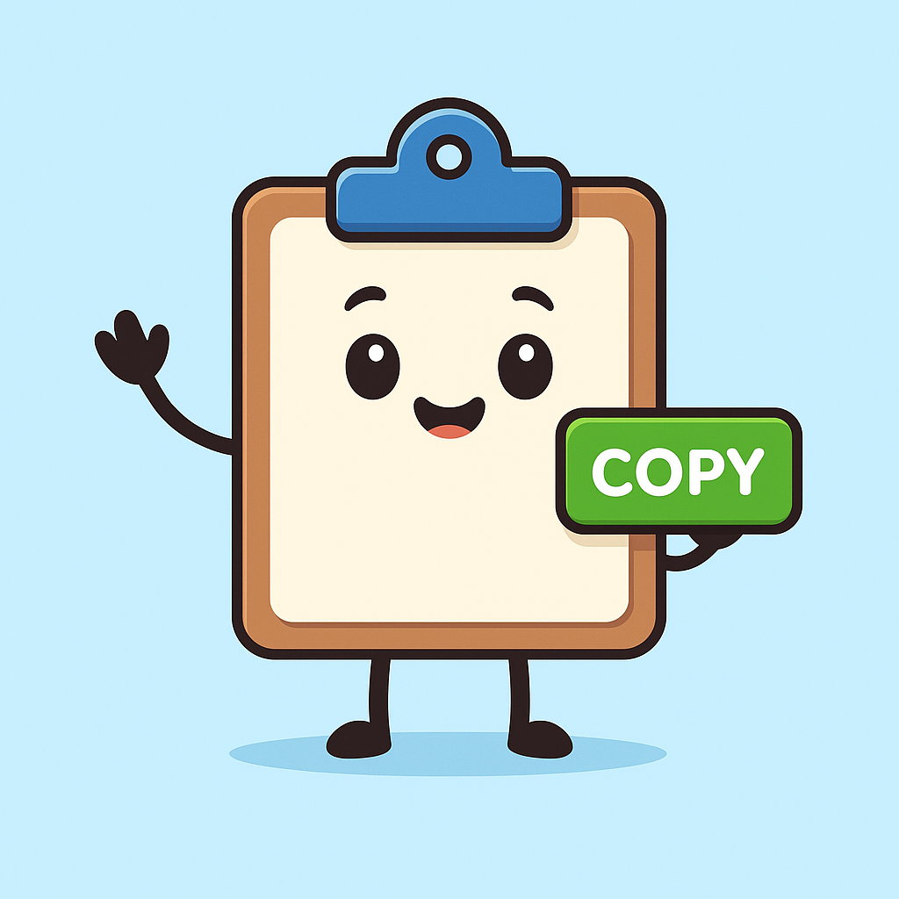

# 📋 Clipboard Buddy



**Clipboard Buddy** is a lightweight, browser-based clipboard management tool built with pure **HTML**, **CSS**, and **JavaScript** — no installs, no dependencies, and no setup required. It helps you quickly **copy**, **paste**, and **manage multiple text snippets** right from your browser.

---

## 🚀 Features

✅ **Simple & Fast Interface** — Manage multiple text fields easily in one place.  
✅ **Copy & Paste Buttons** — Each field includes buttons for one-click clipboard actions.  
✅ **Add or Remove Fields** — Create as many text boxes as you like, or delete unneeded ones.  
✅ **Persistent Clipboard Actions** — Works with your system clipboard using modern browser APIs.  
✅ **Friendly UI** — Includes the adorable Clipboard Buddy mascot and a clean, soothing background.  
✅ **Fully Client-Side** — No data leaves your browser; privacy-friendly and offline-ready.

---

## 🧠 How It Works

Clipboard Buddy uses the modern **Clipboard API** (`navigator.clipboard`) available in most browsers.

- Click **Copy** to send the text from a field to your clipboard.  
- Click **Paste** to pull whatever text is currently on your clipboard into that field.  
- Click **+ Add Field** to create more fields.  
- Click the red **✕ Delete** button to remove any field you don’t need.

> 💡 Tip: Clipboard permissions are handled by your browser, so you may be prompted to allow clipboard access on the first use.

---

## 💻 Installation

You can run Clipboard Buddy locally in seconds:

1. **Clone this repository:**
   ```bash
   git clone https://github.com/Jaibone/clipboard-buddy.git
   cd clipboard-buddy
